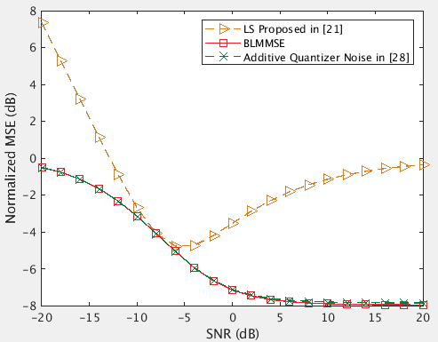

# MIMO Toolkit

## Introduction

The MIMO Toolkit (MTK) compiles a variety of tools and algorithms for MIMO
simulation for receivers with 1-bit ADCs, including:

* Random channel and noise generation
* Channel estimation

The initial goal is to compare the performance of comparator network for MIMO
receivers using 1-bit ADCs. You can find relevant literature in [[1]](#1),
[[2]](#2). If this toolkit is helpful, we kindly ask you to cite our work.

> A. B. L. B. Fernandes, Z. Shao, L. T. N. Landau and R. C. de Lamare (2023).
> Multiuser-MIMO Systems Using Comparator Network-Aided Receivers With 1-Bit
> Quantization. IEEE Transactions on Communications, vol. 71, no. 2, pp.
> 908-922, Feb. 2023.

> L. C. S. Ramos and L. T. N. Landau (2024). Improved Analysis of Comparator
> Network Aided Channel Estimation for MIMO Receivers with 1-Bit ADCs. 2024
> 19th International Symposium on Wireless Communication Systems (ISWCS), Rio
> de Janeiro, Brazil, 2024.

## Usage

Just clone the repository and add the *mtk* folder to the MATLAB path.

## Quick Start

In the *examples* folder, the *blmmse.m* reproduces the BLMMSE channel
estimator in [[3, Fig. 2]](#3).

First, the library generates `iterations` Rayleigh channel realizations of a
`K` x `M` MIMO system with 1-bit ADCs. Then, the library generates a pilot
matrix with length `tau` using submatrices of the DFT operator and noise.

```
H = mtk_generate_channel('rayleigh', params);
Phi = mtk_generate_pilot('dft', params);
N = mtk_generate_noise(params);
```

The `params` struct contains all the relevant information to generate the
matrices:

```
params.K = K;
params.M = M;
params.tau = tau;
params.iterations = iterations;
```

After that, the function `mtk_estimate_channel` estimates the channel for a
single realization for a given SNR (represented by `rho`). You can then iterate
over the channel realizations and plot the results.

```
H_hat = mtk_estimate_channel('blmmse', params);
```



## TODO

- [ ] Analytical results
- [ ] Achievable rate
- [ ] Detection

## References

<a id="1">[1]</a>
A. B. L. B. Fernandes, Z. Shao, L. T. N. Landau and R. C. de Lamare (2023).
Multiuser-MIMO Systems Using Comparator Network-Aided Receivers With 1-Bit
Quantization. IEEE Transactions on Communications, vol. 71, no. 2, pp. 908-922,
Feb. 2023.

<a id="2">[2]</a>
L. C. S. Ramos and L. T. N. Landau (2024). Improved Analysis of Comparator
Network Aided Channel Estimation for MIMO Receivers with 1-Bit ADCs. 2024 19th
International Symposium on Wireless Communication Systems (ISWCS), Rio de
Janeiro, Brazil, 2024.

<a id="3">[3]</a>
Y. Li, C. Tao, G. Seco-Granados, A. Mezghani, A. L. Swindlehurst and L. Liu
(2017). Channel Estimation and Performance Analysis of One-Bit Massive MIMO
Systems. IEEE Transactions on Signal Processing, vol. 65, no. 15, pp.
4075-4089, 1 Aug.1, 2017.

